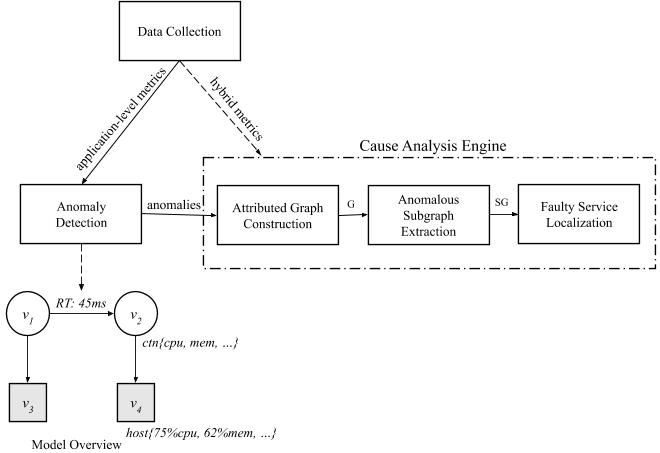
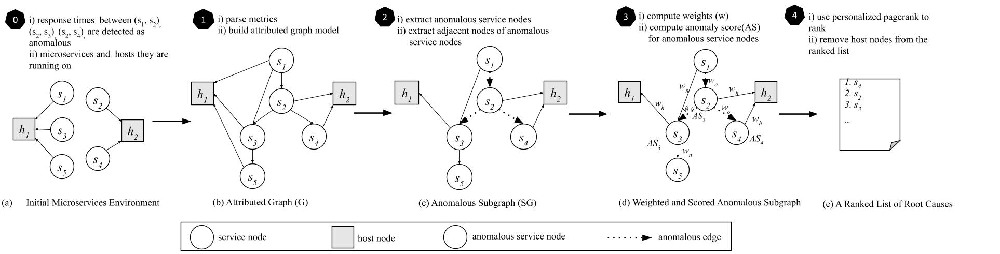

## MicroRCA:  Microservices root cause analysis

This project provides the source code of MicroRCA.

### Quick Start
MicroRCA requires data collected from application-level (response times between two communicating services) and system-level (resource usage in container and host). An example of the data is given in folder [data](/data).

#### Presequisite
* python 3+
* [nx](https://networkx.github.io/documentation/stable/index.html)
* sklearn-learn

#### 1. Clone the Repository
`git clone https://github.com/elastisys/MicroRCA.git`

#### 2. Customize the prefix of files
Change the `folder`, `faults_types` and the `file name` of csv files accordingly

#### 3. Run the code and tune parameters
Tune parameters `alpha` and `ad_threshold` with your data.

<!-- ### MicroRCA Overview

 -->

### MicroRCA Procedures

### Paper Reference
Li Wu, Johan Tordsson, Erik Elmroth, Odej Kao.  
**MicroRCA: Root Cause Localization of Performance Issues in Microservices**  
IEEE/IFIP Network Operations and Management Symposium (NOMS),
20-24 April 2020, Budapest, Hungary  
Download: [[PDF](https://hal.inria.fr/hal-02441640/document#:~:text=MicroRCA%20infers%20root%20causes%20in,propagation%20across%20services%20and%20machines)] [[BibTeX](https://dblp.uni-trier.de/rec/bibtex/conf/noms/WuTEK20)]
